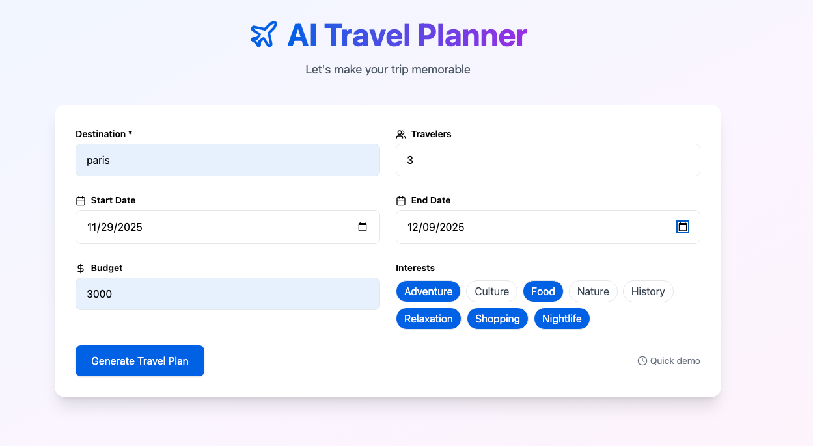
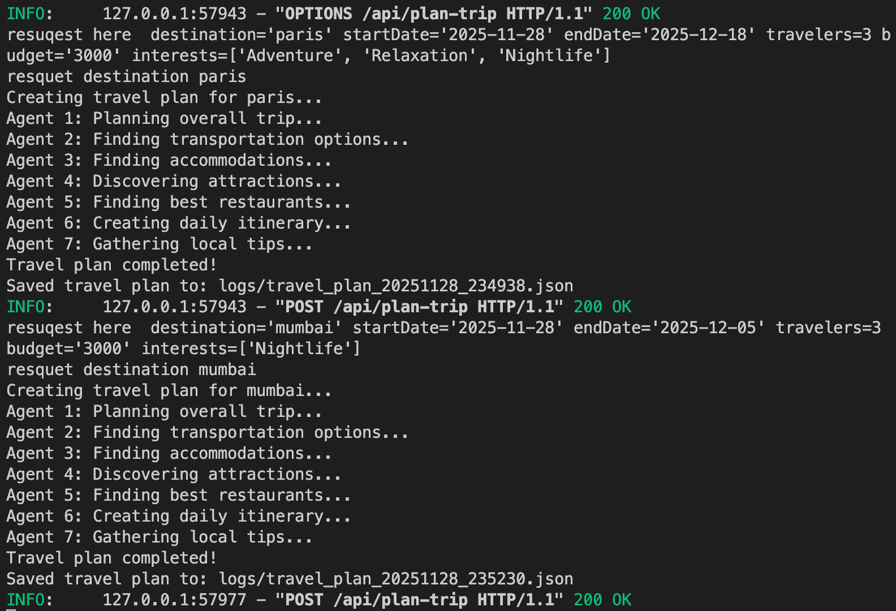

# AI Travel Planner — Personalized Trip Recommendation Engine

  

**Subtitle:** An AI-driven system that transforms user preferences into curated travel experiences.

---

## 🧭 Problem Statement

Traditional travel apps ask:  
> “Where do you want to go?”  

But travelers think in terms of **preferences and constraints**:  
- Flexible destinations  
- Travel dates  
- Number of travelers  
- Areas of interest (food, culture, adventure, relaxation)  

Existing platforms provide static lists and generic suggestions. Users need **personalized, context-aware recommendations** that match their inputs.

**Solution:** AI Travel Planner  
A multi-agent system that takes **user inputs** and generates **optimized, curated itineraries**.

---

## 🤖 Key Features

- Input: destination(s), travel dates, number of travelers, interests  
- Output:  
  - Recommended places and experiences  
  - Suggested routes and timing  
  - Local events, attractions, and food recommendations  
  - Context-aware adjustments (weather, accessibility, traveler count)

---

## 🧩 Multi-Agent Architecture

### Agent 1: User Profile Agent
- Stores traveler preferences  
- Learns patterns over multiple sessions  
- Adjusts recommendations based on past behavior

### Agent 2: Interest & Preference Agent
- Maps user input to structured experience categories  
- Ensures personalized and relevant recommendations

### Agent 3: Geo & Routing Agent
- Finds walkable paths, viewpoints, and travel routes  
- Optimizes itineraries based on proximity and timing  

### Agent 4: Culture & Activity Agent
- Suggests events, museums, cafes, local attractions  
- Matches activities to user interests

### Agent 5: Weather/Context Agent
- Pulls weather forecasts  
- Recommends indoor/outdoor adjustments  
- Adjusts activity timing and type based on conditions

### Coordinator Agent
- Orchestrates the flow:  
  1. Collect user inputs  
  2. Query specialized agents  
  3. Merge results into a **curated itinerary**  
- Handles retries and loops to resolve missing/conflicting data

---

## ⚙️ Technical Concepts

- **Multi-Agent System:** 5 specialized agents + coordinator, sequential and parallel workflows, retry mechanisms  
- **APIs & Tools:** Google Maps / Geo API, Weather API, optional structured data ingestion  
- **Session & Memory:** Session-level memory, long-term preference learning  
- **Optimization & Observability:** Route and experience optimization, logging, tracing, metrics  
- **Evaluation:** Automated quality evaluation, logging of failure cases

---

## 🛠️ Installation & Setup

### Prerequisites
- Python 3.10+  
- Google API key (for location search & places)  
- Weather API key  
- Gemini API key (optional, for AI reasoning)

# Set API keys
export GOOGLE_API_KEY="YOUR_KEY"
export WEATHER_API_KEY="YOUR_KEY"
export GEMINI_API_KEY="YOUR_KEY"


# Backend Setup

1. Create virtual environment:
   ```
   python3 -m venv venv
   ```

2. Activate virtual environment:
   - Windows: `venv\Scripts\activate`
   - Mac/Linux: `source venv/bin/activate`

3. Install dependencies:
   ```
   pip install -r requirements.txt
   ```

4. Update .env file with your Gemini API key

5. Run server:
   ```
   uvicorn main:app --reload --port 8000
   ```

6. Visit http://localhost:8000/docs for API documentation

# Frontend Setup

1. Install dependancies
```
npm install
```
2. Run the frontend server

```
npm run dev

```

## Screenshots

### App Interface


### Agent Flow Diagram

